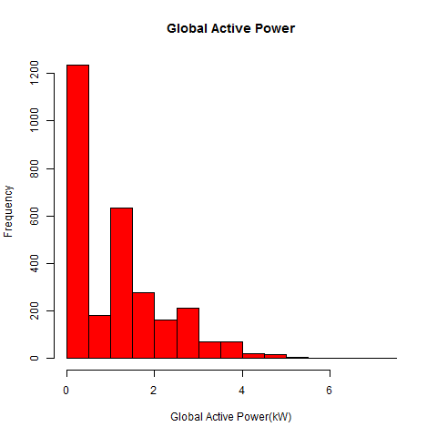

# Project I

Coursera Exploratory Data Analysis

Review Dataset where been can look that it is separate by semicolon, have Header. 

According to instruction we should select elements just Date 1/2/2007 to 2/2/2007

The first plot as such it been can see a histogram where data is getting with column global active power and it is segmented by Date

[Histogram Global Active Power](https://github.com/Hramos93/R_projectos/blob/master/plot4.R)

Second Graph  where it shows a plot the Global active power taking in cosideration the time.

[Plot Global Active Power in Time ](https://github.com/Hramos93/R_projectos/blob/master/plot2.R)

The third graph is a plot where it been can see lines that consider distincts segment or submetering  

[plot Submetering   ](https://github.com/Hramos93/R_projectos/blob/master/plot3.R)

Finally, es una cuadrícula que incluye las tres gráficas y una gráfica de voltaje.
[plot Submetering   ](https://github.com/Hramos93/R_projectos/blob/master/plot4.R)
